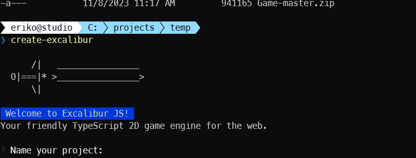
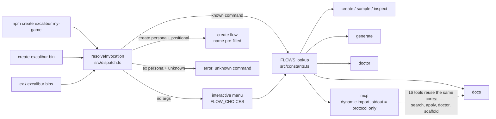
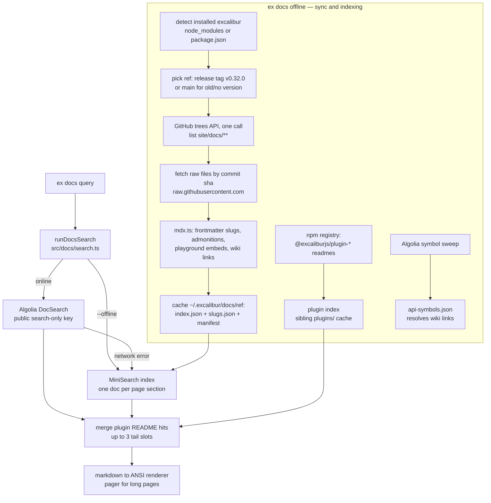
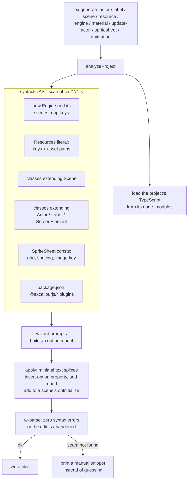
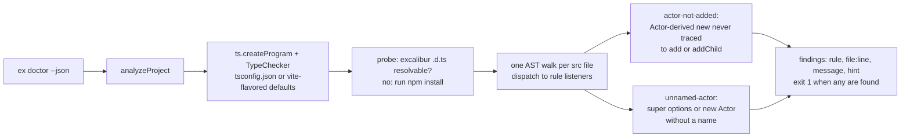

# create-excalibur

## Scaffolding for ExcaliburJS projects

With NPM:
```
npx create-excalibur@latest
```



## The `ex` CLI

Installing the package globally also gives you the `ex` command:

```
npm i -g create-excalibur   # installs `ex` (and an `excalibur` alias)
ex            # interactive menu (same as create-excalibur)
ex create     # scaffold a game from a template
ex sample     # scaffold a sample project
ex inspect    # download a showcase game
ex docs       # search the Excalibur docs & API
ex generate   # generate an actor, label, scene, resource, engine settings, material, spritesheet, or animation — or update an actor's options (alias: ex g)
ex doctor     # type-aware diagnostics: actors never added to a scene, unnamed actors
ex upgrade    # migrate your game to a newer Excalibur version, codemod-style (alias: ex up)
ex mcp        # MCP server over stdio (docs + codegen tools for AI agents)
```

### `ex docs` — search the docs from your terminal

```
ex docs                         # type-as-you-search prompt
ex docs actor collision         # search, pick a result, read it in the terminal
ex docs Vector.distance -1      # open the top result immediately (no picker)
ex docs actor collision --list  # just print the matches + links (pipe friendly)
ex docs vector --json           # machine-readable results
ex docs --help                  # all options
```

Search is powered by the excaliburjs.com DocSearch (Algolia) index. Pages are rendered as
markdown in the terminal with links back to the online docs; long pages open in `$PAGER`/`less`.

**Version aware:** when run inside a project, `ex docs` detects the installed `excalibur`
version (from `node_modules` or `package.json`) and renders pages from that release's docs
(`--ref v0.32.0` to override; `--ref main` for the latest).

**Offline:**

```
ex docs offline            # download the docs for your Excalibur version (~1 MB) + plugin READMEs + build a local index
ex docs actor --offline    # search the downloaded docs only
ex docs offline --status   # what's cached and where (~/.excalibur/docs, or $EXCALIBUR_HOME)
ex docs offline --clear    # remove the cache
```

When the network is unavailable, `ex docs` falls back to the offline index automatically.

**Plugins:** `ex docs offline` also indexes the `@excaliburjs/plugin-*` READMEs (Tiled, Aseprite,
LDtk, perlin, …) from npm, so plugin usage is searchable too — filter with `--kind plugin`.

### `ex doctor` — check your game for common mistakes

```bash
ex doctor           # human-readable report, exits 1 when problems are found
ex doctor --json    # machine-readable findings (CI friendly)
```

Type-aware diagnostics powered by your project's own TypeScript and excalibur's type
declarations (run `npm install` first). Twelve rules, each grounded in bugs found in shipped
games: `actor-not-added`, `unnamed-actor`, `dont-shadow-excalibur-internals` (a field like
`isActive` on an Entity subclass shadows engine state and silently kills the entity — with a
tip to set `"noImplicitOverride": true`), `leaked-subscription` (`.on()` to an engine-lifetime
emitter with no cleanup — handlers compound across scene restarts), `dead-collision-hooks`
(collision handlers while the Engine has `physics: false`), `dont-mutate-shared-graphics`
(writes to cached `getAnimation()` results — `.clone()` first), `unknown-scene-key`
(`goToScene` typos checked against the `scenes:` map), `dont-call-lifecycle-hooks`,
`camera-pos-aliasing` (`camera.pos = actor.pos` writes through to the live vector),
`no-reserved-tags` (engine-owned `ex.*` tags), `no-reserved-uniforms` (a Material/ScreenShader
source declares a built-in like `u_time_ms` or `v_uv` with a conflicting GLSL type — the engine
sets it by name at draw time, so it silently reads as zeros or fails to link), and
`prefer-seeded-random` (`Math.random()`,
unseeded `new Random()`, and duplicate seeds that correlate streams). Run `ex doctor --help`
for the list. Only `.ts` files under `src/` are checked.

Ignore a finding case-by-case with eslint-style comments — after a report, an interactive
prompt offers to insert them for you:

```ts
// ex-doctor-ignore-next-line actor-not-added
new OffscreenHelper();
new Cursor(); // ex-doctor-ignore-line unnamed-actor
```

Omit the rule list to ignore every rule on that line.

### `ex upgrade` — codemod-style version migrations

```bash
ex upgrade --dry-run       # preview the full migration plan, write nothing
ex upgrade                 # plan preview + one confirm, then apply + bump package.json
ex upgrade --to next       # target v1 (the `next` prerelease); default is latest
ex upgrade --migrate-only  # rewrite code but leave package.json alone
```

Chained migrations (v0.29.3 onward, ng-update style) rewrite your source with
formatting-preserving splices, classified against your project's *installed* excalibur types —
so run it **before** installing the new version. Automated: `ex.Input.*` flattening, event
`.delta` → `.elapsed`, `goto` → `goToScene`, `Vector.size` → `magnitude`,
`EventDispatcher` → `EventEmitter`, antialiasing accessors, `easeTo/easeBy` → `moveTo/moveBy`,
Particle option renames, shader `v_texcoord` → `v_uv`, TileMap `compositeStrategy` pinning, and
more. Changes that need human judgment (collision events now yield `Collider`, the v1
screen-space rooting change) get `// ex-upgrade(<id>): …` comments inserted at each site with a
link and recipe. Requires a clean git tree (your undo) unless `--allow-dirty`; never runs
`npm install` for you.

### `ex mcp` — MCP server for AI agents

Exposes the CLI's capabilities as [Model Context Protocol](https://modelcontextprotocol.io) tools
over stdio, so agents like Claude Code and OpenCode can search the Excalibur docs, scaffold
projects, and generate code in your project.

Claude Code (add `-s user` to register it globally instead of per-project):

```
claude mcp add excalibur -- npx -y create-excalibur mcp
```

OpenCode — add to `opencode.json` in your project (or `~/.config/opencode/opencode.json`):

```json
{
  "$schema": "https://opencode.ai/config.json",
  "mcp": {
    "excalibur": {
      "type": "local",
      "command": ["npx", "-y", "create-excalibur", "mcp"],
      "enabled": true
    }
  }
}
```

```
ex mcp                      # serve, tools operate on the current directory by default
ex mcp --project <dir>      # point the tools at a specific project
ex mcp --help
```

Tools: `docs_search`, `docs_get_page`, `docs_sync`, `analyze_project`, `generate_actor`,
`generate_label`, `generate_scene`, `generate_resource`, `generate_material`, `generate_spritesheet`, `generate_animation`, `update_actor`,
`update_engine`, `list_templates`, `create_project`, `doctor`, `upgrade`. Docs tools also cover the `@excaliburjs/plugin-*` READMEs
(`kind: "plugin"`, `/plugins/<name>` slugs), and `analyze_project` reports installed plugins. Generation tools accept `dryRun` for previews; `create_project` skips
`npm install`/`git init` unless asked. Errors come back with actionable hints so agents can
self-correct.

> Note: `ex` shadows the rarely-used system `ex` (vi's line-editor mode) while the
> npm global bin dir is first on your PATH. Use the `excalibur` alias if that bothers you.

## Architecture

How the pieces fit together. Everything is TypeScript ESM; each command is a "flow"
registered in `src/constants.ts` and dispatched from `index.ts`. Development runs the
sources directly (Node's type stripping — no build step in the dev loop); publishing
compiles to `dist/` via `tsc`, which is what the bins run on end-user machines.

### Command dispatch

Both bins point at the compiled `dist/index.js`. Dispatch is persona-aware: the create persona treats a bare
positional as a project name, while `ex`/`excalibur` stay strict so a typo never scaffolds.



### `ex docs` — search and the offline index

Searches hit the site's Algolia index first and fall back to a locally built index; `ex docs
offline` builds that index straight from the Excalibur repo's docs source, pinned to your
installed version.



### `ex generate` — what it looks for in your TypeScript

Generation is a wizard/apply split: the wizard only builds an option model, and `apply*()` does
the edits. Edits are minimal text splices validated by re-parsing — never a full AST reprint, so
your formatting and comments survive. It uses **your project's own TypeScript** (never bundled;
TypeScript 7 removed the compiler API, so it asks for 5.x/6.x).



### `ex doctor` — type-aware diagnostics

Doctor is the one place a full `ts.Program` + TypeChecker is used (generate stays syntactic):
the checker is what catches `class Boss extends Monster extends Actor`. Rules are kind-keyed
listeners over a single AST walk per file, the same shape typescript-eslint uses.



## Running this project locally

Run `npm run dev`, or `node index.ts docs <query>` (Node 22.18+/24 — the dev loop runs
the TypeScript sources directly via type stripping; end users only ever run compiled JS).

Tests: `npm test` · Typecheck: `npm run typecheck` · Build: `npm run build` ·
Publish smoke test: `npm run smoke:pack`
